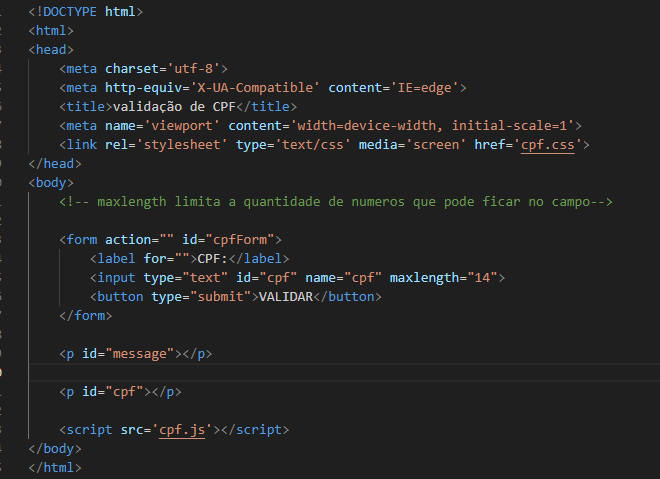
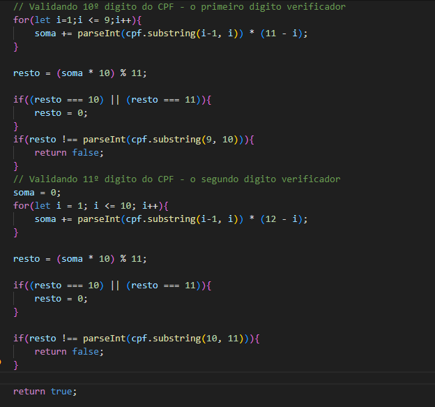
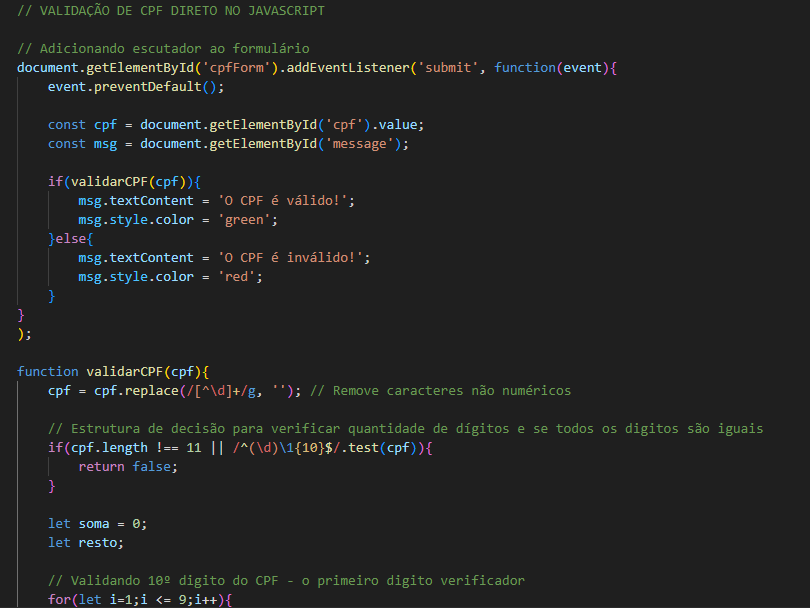
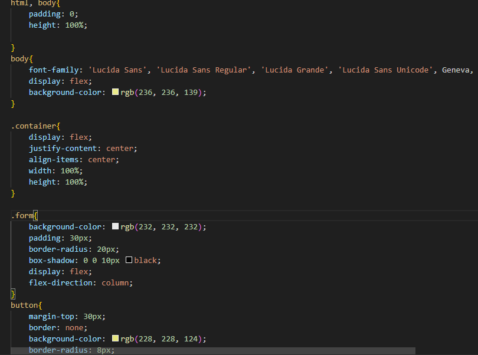
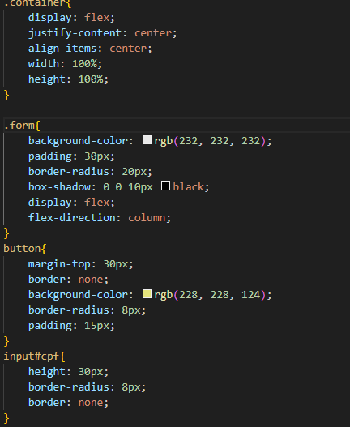
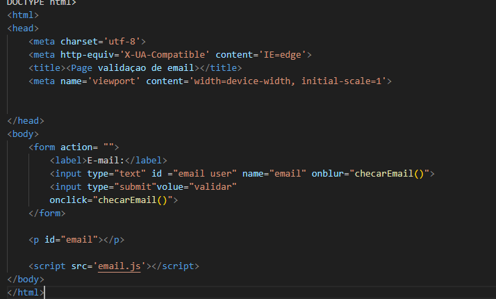
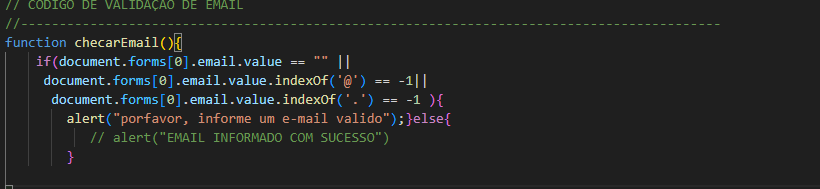

# validacoes_1e2

-VALIDAÇÃO DE CPF-
-codígos
- Html:
      

- JS:  

- CSS:  

-VALIDAÇÃO DE EMAIL-
   -html:
  

  -JS:
 
# Validação de CPF e E-mail em JavaScript

Neste projeto, implementamos validações para CPF e e-mail usando JavaScript. Cada tipo de validação é realizado com base em regras específicas e envolve o uso de estruturas de controle como `for` e `if-else`.

## Validação de CPF

A validação de CPF garante que o número fornecido é válido de acordo com o algoritmo específico para verificação dos dígitos verificadores. O processo inclui os seguintes passos:

 **Limpeza do CPF**: Remove quaisquer caracteres não numéricos, garantindo que o CPF seja processado apenas com os dígitos.

 **Verificação do Comprimento**: Confirma se o CPF possui exatamente 11 dígitos.

 **Cálculo dos Dígitos Verificadores**:
* O primeiro dígito verificador é calculado com base nos 9 primeiros dígitos do CPF.
* O segundo dígito verificador é calculado com base nos 10 primeiros dígitos do CPF, incluindo o primeiro dígito verificador.

 **Validação**: Compara os dígitos verificadores calculados com os fornecidos no CPF. Se eles corresponderem, o CPF é considerado válido.

### Validação de E-mail ###

A validação de e-mail verifica se o endereço de e-mail fornecido está correto.

 ### Verificação de Caracteres Essenciais ###
   * O e-mail deve conter o caractere "@".
   * O e-mail deve terminar com ".com".

### Mensagens de Feedback ### :
   * Se o e-mail não contiver o caractere "@" ou não terminar com ".com", será exibida uma mensagem informando que o e-mail é inválido.
   * Se o e-mail estiver no formato correto, será exibida uma mensagem confirmando que o e-mail é válido.

### Conclusão ###

A validação de CPF e e-mail é importante para garantir que os dados inseridos estejam no formato correto e sejam válidos. A validação de CPF assegura a integridade dos números fornecidos, enquanto a validação de e-mail confirma que o e-mail atende a critérios básicos de formato.
